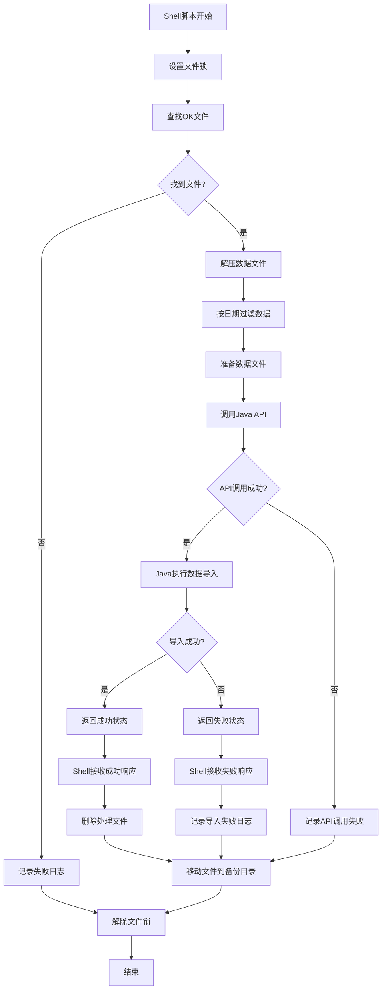

# 抵债资产对公贷款关联表数据同步功能说明书（架构重构版）

## 1. 概述

### 1.1 脚本名称
`ift_ncbs_cgmdab_cl_loan_rlvc.sh`

### 1.2 功能描述
本脚本用于处理抵债资产对公贷款关联表的数据文件处理和管理，负责文件查找、解压、过滤、备份等操作，数据导入功能通过HTTP调用Java微服务完成，实现了Shell和Java的职责分离。

### 1.3 系统信息
- **系统名称**: 税务管理系统
- **脚本功能**: 抵债资产对公贷款关联表数据文件处理
- **版本**: v2.0 (架构重构版)
- **编写者**: 祝刚

### 1.4 架构变更说明
- **Shell职责**: 文件处理、数据过滤、文件管理、并发控制、日志记录
- **Java职责**: 数据导入、数据库操作
- **通信方式**: HTTP REST API调用

## 2. 功能详细说明

### 2.1 Shell脚本主要功能
1. **数据文件处理**: 自动查找并处理符合命名规范的压缩数据文件
2. **数据过滤**: 根据维护日期过滤昨日数据
3. **文件管理**: 处理完成后移动文件到备份目录
4. **并发控制**: 通过文件锁防止重复执行
5. **日志记录**: 详细记录处理过程和结果
6. **Java服务调用**: 通过HTTP接口调用Java微服务完成数据导入

### 2.2 Java微服务功能
1. **数据导入**: 接收处理后的数据文件路径，清空目标表并导入新数据
2. **数据库操作**: 执行TRUNCATE和INSERT操作
3. **结果返回**: 返回导入结果状态给Shell脚本

### 2.3 核心参数配置

#### 2.3.1 表信息
- **源表名**: `cgmdab_cl_loan_rlvc`
- **目标表名**: `tp_ncbs_cgmdab_cl_loan_rlvc`
- **维护日期列位置**: 第47列

#### 2.3.2 目录配置
- **源文件目录**: `/cebtms/files/ift/ecas`
- **工作目录**: `/cebtms/files/ift/work/cgmdab_cl_loan_rlvc`
- **备份目录**: `/cebtms/files/bak/ift/ecas`
- **日志目录**: `/cebtms/files/logs/batch/YYYYMMDD`

#### 2.3.3 Java服务接口配置
- **服务地址**: `http://tms-app-cdc:19201`
- **接口路径**: `/ift/NcbsCgmdabClLoanRlv/sync`
- **完整URL**: `http://tms-app-cdc:19201/ift/NcbsCgmdabClLoanRlv/sync`
- **请求方法**: POST
- **内容类型**: application/json

#### 2.3.4 数据文件配置
- **数据分隔符**: `|+|`
- **目标文件名**: `tp_ncbs_cgmdab_cl_loan_rlvc.txt`

#### 2.3.5 文件命名规范
- **数据文件模式**: `a_ncbs_cgmdab_cl_loan_rlvc_YYYYMMDD_*.dat.gz`
- **确认文件模式**: `a_ncbs_cgmdab_cl_loan_rlvc_YYYYMMDD_*.dat.gz.ok`

## 3. 数据表结构

### 3.1 表字段定义
脚本处理的表包含以下49个字段：

| 序号 | 字段名 | 说明 |
|-----|--------|------|
| 1 | commute_debt_ast_no | 抵债资产编号 |
| 2 | ln_due_bill_no | 借据号 |
| 3 | dtl_seri_no | 明细序号 |
| 4 | cred_ast_impai_provis | 信贷资产减值准备 |
| 5 | inte_acct_acct_no | 利息账户账号 |
| 6 | rcv_cost | 收取费用 |
| 7 | pay_comp_price | 支付补偿价格 |
| 8 | repay_pri_amt | 偿还本金金额 |
| 9 | repay_int_amt | 偿还利息金额 |
| 10 | commute_debt_ast_assoc_stat | 抵债资产关联状态 |
| 11 | depr_retu_pri | 折旧返还本金 |
| 12 | depr_retu_int | 折旧返还利息 |
| 13 | retu_regu_pri | 返还正常本金 |
| 14 | retu_overd_pri | 返还逾期本金 |
| 15 | retu_dead_ln_pri | 返还呆账贷款本金 |
| 16 | retu_bad_debt_pri | 返还坏账本金 |
| 17 | retu_rece_accru_int | 返还应收应计利息 |
| 18 | retu_rece_deb_int | 返还应收欠息 |
| 19 | retu_rece_accru_pena_int | 返还应收应计罚息 |
| 20 | retu_rece_pena_int | 返还应收罚息 |
| 21 | retu_on_bal_accru_compou_int | 返还表内应计复利 |
| 22 | retu_on_bal_compou_int | 返还表内复利 |
| 23 | retu_wri_off_pri | 返还核销本金 |
| 24 | cred_ast_impai_provis_acct_no | 信贷资产减值准备账号 |
| 25 | to_be_deal_with_commute_debt_ast_occ_amt | 待处理抵债资产占用金额 |
| 26 | contr_no | 合同号 |
| 27 | cust_no | 客户号 |
| 28 | revol_fund_amt | 循环资金金额 |
| 29 | revol_amt1 | 循环金额1 |
| 30 | revol_amt2 | 循环金额2 |
| 31 | rese_fie | 保留字段 |
| 32 | rese_fie_1 | 保留字段1 |
| 33 | rese_fie_2 | 保留字段2 |
| 34 | dispo_cost | 处置成本 |
| 35 | to_be_retu_dispo_cost | 待返还处置成本 |
| 36 | retu_col_accru_int | 返还收取应计利息 |
| 37 | retu_col_deb_int | 返还收取欠息 |
| 38 | retu_col_accru_pena_int | 返还收取应计罚息 |
| 39 | retu_col_pena_int | 返还收取罚息 |
| 40 | retu_off_bal_accru_compou_int | 返还表外应计复利 |
| 41 | retu_off_bal_compou_int | 返还表外复利 |
| 42 | retu_wri_off_int | 返还核销利息 |
| 43 | retu_alr_wri_off_pri_int | 返还已核销本息 |
| 44 | retu_wri_off_int_compou_int | 返还核销利息复利 |
| 45 | mainte_tell | 维护柜员 |
| 46 | mainte_inst | 维护机构 |
| 47 | mainte_dt | 维护日期 |
| 48 | mainte_tm | 维护时间 |
| 49 | record_stat | 记录状态 |

### 3.2 数据格式
- **字段分隔符**: `|+|`
- **数据编码**: UTF-8
- **日期格式**: YYYY-MM-DD

## 4. 处理流程

### 4.1 整体架构流程



### 4.2 Shell脚本详细流程

1. **环境初始化**
   - 设置脚本目录和相关路径变量
   - 创建必要的工作目录和备份目录
   - 配置日志文件路径

2. **文件锁控制**
   - 检查锁文件是否存在
   - 创建锁文件防止重复执行
   - 异常时自动解锁

3. **文件查找与处理**
   - 根据昨日日期构建文件名模式
   - 在源目录查找符合条件的`.ok`文件
   - 验证对应的数据文件是否存在

4. **数据预处理**
   - 解压`.gz`压缩文件到工作目录
   - 使用AWK按维护日期过滤昨日数据
   - 重命名文件为标准格式

5. **Java服务调用**
   - 构建HTTP请求参数
   - 调用Java微服务API
   - 处理API响应结果

6. **文件清理与备份**
   - 根据处理结果决定后续操作
   - 删除处理完成的临时文件
   - 移动原始文件到备份目录

### 4.3 Java微服务流程

1. **接收请求**
   - 接收Shell传递的文件路径参数
   - 验证文件存在性和格式

2. **数据库操作**
   - 清空目标表数据(`TRUNCATE`)
   - 使用批量导入工具导入新数据
   - 验证导入结果

3. **返回响应**
   - 构建标准化响应格式
   - 返回操作状态和结果信息

## 5. API接口规范

### 5.1 请求接口

#### 接口信息
- **URL**: `http://tms-app-cdc:19201/ift/NcbsCgmdabClLoanRlv/sync`
- **Method**: POST
- **Content-Type**: application/json

#### 请求参数
```json
{
    "filePath": "/cebtms/files/ift/work/cgmdab_cl_loan_rlvc/tp_ncbs_cgmdab_cl_loan_rlvc.txt",
    "processDate": "2025-08-24",
    "tableName": "tp_ncbs_cgmdab_cl_loan_rlvc"
}
```

#### 参数说明
| 参数名 | 类型 | 必填 | 说明 |
|--------|------|------|------|
| filePath | String | 是 | 处理后的数据文件完整路径 |
| processDate | String | 是 | 数据处理日期(YYYY-MM-DD) |
| tableName | String | 是 | 目标表名 |

### 5.2 响应接口

#### 成功响应
```json
{
    "code": "200",
    "message": "数据导入成功",
    "data": {
        "importedRows": 12345,
        "processTime": "2025-08-25 10:30:15",
        "tableName": "tp_ncbs_cgmdab_cl_loan_rlvc"
    },
    "success": true
}
```

#### 失败响应
```json
{
    "code": "500",
    "message": "数据导入失败：文件不存在或格式错误",
    "data": null,
    "success": false
}
```

#### 响应参数说明
| 参数名 | 类型 | 说明 |
|--------|------|------|
| code | String | 响应状态码 |
| message | String | 响应消息 |
| success | Boolean | 操作是否成功 |
| data | Object | 响应数据对象 |
| importedRows | Integer | 导入的记录数 |
| processTime | String | 处理完成时间 |

## 6. Shell脚本调用示例

### 6.1 HTTP调用代码
```bash
# 构建请求参数
request_data=$(cat <<EOF
{
    "filePath": "${work_dir}/${TARGET_FILE}",
    "processDate": "${yesterday_with_dash}",
    "tableName": "${org_table_name}"
}
EOF
)

# 调用Java API
echo `date "+%Y-%m-%d %H:%M:%S"` "调用Java API导入数据" >> ${LOGFILE}
response=$(curl -s -X POST \
    -H "Content-Type: application/json" \
    -d "$request_data" \
    "http://tms-app-cdc:19201/ift/NcbsCgmdabClLoanRlv/sync")

# 解析响应结果
success=$(echo "$response" | jq -r '.success')
message=$(echo "$response" | jq -r '.message')
imported_rows=$(echo "$response" | jq -r '.data.importedRows // "N/A"')

if [ "$success" = "true" ]; then
    echo `date "+%Y-%m-%d %H:%M:%S"` "数据导入成功，导入记录数: $imported_rows" >> ${LOGFILE}
else
    echo `date "+%Y-%m-%d %H:%M:%S"` "数据导入失败: $message" >> ${LOGFILE}
    exit 1
fi
```

## 7. 错误处理与日志

### 7.1 Shell脚本错误处理
- **文件锁检查**: 防止并发执行
- **文件存在性验证**: 确保必要文件存在
- **API调用检查**: 验证HTTP请求结果
- **响应解析**: 处理JSON响应格式
- **异常退出处理**: 确保锁文件正确清理

### 7.2 Java服务错误处理
- **参数验证**: 检查请求参数完整性和格式
- **文件访问**: 验证文件路径和权限
- **数据库连接**: 处理数据库连接异常
- **事务管理**: 确保数据操作的原子性
- **异常响应**: 返回标准化错误信息

### 7.3 日志记录
- **Shell日志**: `/cebtms/files/logs/batch/YYYYMMDD/tms_sync_ift_data_cgmdab_cl_loan_rlvc_YYYYMMDD.log`
- **Java日志**: 由Spring Boot框架统一管理
- **记录内容**: 
  - 处理时间戳
  - 文件处理状态
  - API调用结果
  - 数据库操作结果
  - 错误信息和退出码

### 7.4 退出码说明
- **0**: 正常执行完成
- **1**: 处理失败(文件不存在或API调用失败)
- **100**: 重复执行被阻止

## 8. 依赖环境

### 8.1 Shell环境依赖
- **操作系统**: Linux
- **Shell**: Bash
- **外部工具**: gunzip, awk, curl, jq, find

### 8.2 Java环境依赖
- **JDK版本**: Java 8+
- **框架**: Spring Boot
- **数据库**: MySQL 5.7+
- **连接池**: HikariCP (推荐)

### 8.3 网络依赖
- Shell脚本服务器需要能访问Java微服务
- Java微服务需要能访问数据库服务器
- 确保HTTP端口19201可访问

## 9. 使用说明

### 9.1 执行方式
```bash
./ift_ncbs_cgmdab_cl_loan_rlvc.sh
```

### 9.2 执行时机
- 建议在每日凌晨执行，处理前一天的数据
- 确保Java微服务正常运行
- 确保源文件已准备就绪(存在对应的.ok文件)

### 9.3 监控要点
- 检查Shell日志文件确认文件处理结果
- 检查Java服务日志确认数据导入结果
- 验证数据导入数量是否正确
- 关注备份目录文件累积情况
- 监控API调用的响应时间和成功率

## 10. 注意事项

### 10.1 架构相关
1. **服务依赖**: Shell脚本依赖Java微服务正常运行
2. **网络稳定**: API调用需要稳定的网络连接
3. **超时设置**: 配置合适的HTTP请求超时时间
4. **重试机制**: 可考虑在API调用失败时进行重试

### 10.2 数据安全
1. **数据备份**: Java服务清空表前确保有数据备份
2. **事务管理**: 使用数据库事务确保数据一致性
3. **文件权限**: 确保相关目录和文件权限设置正确
4. **网络安全**: 考虑API接口的认证和授权

### 10.3 性能优化
1. **批量导入**: Java服务使用批量导入提高效率
2. **连接复用**: 合理配置数据库连接池
3. **内存管理**: 处理大文件时注意内存使用
4. **并发控制**: 通过文件锁避免重复处理

## 11. 维护建议

### 11.1 Shell脚本维护
1. **定期清理**: 清理备份目录中的历史文件
2. **日志轮转**: 配置日志文件定期归档和清理
3. **性能监控**: 监控文件处理时间和资源使用

### 11.2 Java服务维护
1. **应用监控**: 监控服务健康状态和性能指标
2. **数据库监控**: 关注数据导入性能和连接状态
3. **日志分析**: 定期分析错误日志和性能日志
4. **版本管理**: 建立合理的发布和回滚机制

### 11.3 整体维护
1. **接口文档**: 维护API接口文档的准确性
2. **错误告警**: 配置处理失败时的告警机制
3. **容量规划**: 根据数据增长趋势进行容量规划
4. **灾备方案**: 制定完善的灾备和恢复方案