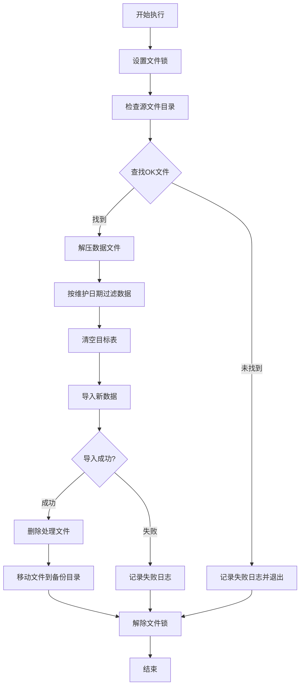

# 抵债资产对公贷款关联表数据同步功能说明书

## 1. 概述

### 1.1 脚本名称
`ift_ncbs_cgmdab_cl_loan_rlvc.sh`

### 1.2 功能描述
本脚本用于处理抵债资产对公贷款关联表的数据同步，从源文件目录读取压缩数据文件，解压后按维护日期过滤，并导入到目标数据库表中。

### 1.3 系统信息
- **系统名称**: 税务管理系统
- **脚本功能**: 抵债资产对公贷款关联表数据处理
- **版本**: v1.0 (2025-02-24)
- **编写者**: 祝刚

## 2. 功能详细说明

### 2.1 主要功能
1. **数据文件处理**: 自动查找并处理符合命名规范的压缩数据文件
2. **数据过滤**: 根据维护日期过滤昨日数据
3. **数据导入**: 清空目标表并导入新数据
4. **文件管理**: 处理完成后移动文件到备份目录
5. **并发控制**: 通过文件锁防止重复执行
6. **日志记录**: 详细记录处理过程和结果

### 2.2 核心参数配置

#### 2.2.1 表信息
- **源表名**: `cgmdab_cl_loan_rlvc`
- **目标表名**: `tp_ncbs_cgmdab_cl_loan_rlvc`
- **维护日期列位置**: 第47列

#### 2.2.2 目录配置
- **源文件目录**: `/cebtms/files/ift/ecas`
- **工作目录**: `/cebtms/files/ift/work/cgmdab_cl_loan_rlvc`
- **备份目录**: `/cebtms/files/bak/ift/ecas`
- **日志目录**: `/cebtms/files/logs/batch/YYYYMMDD`

#### 2.2.3 数据导入配置
- **数据分隔符**: `|+|`
- **导入工具**: mysqlimport
- **导入模式**: 本地导入 (--local)
- **详细输出**: 启用 (--verbose)
- **Socket连接**: `/mysqldata/3309/socket/mysql.sock`

#### 2.2.4 TABLE_COLUMNS完整配置
脚本中定义的完整字段列表：
```
commute_debt_ast_no,ln_due_bill_no,dtl_seri_no,cred_ast_impai_provis,inte_acct_acct_no,rcv_cost,pay_comp_price,repay_pri_amt,repay_int_amt,commute_debt_ast_assoc_stat,depr_retu_pri,depr_retu_int,retu_regu_pri,retu_overd_pri,retu_dead_ln_pri,retu_bad_debt_pri,retu_rece_accru_int,retu_rece_deb_int,retu_rece_accru_pena_int,retu_rece_pena_int,retu_on_bal_accru_compou_int,retu_on_bal_compou_int,retu_wri_off_pri,cred_ast_impai_provis_acct_no,to_be_deal_with_commute_debt_ast_occ_amt,contr_no,cust_no,revol_fund_amt,revol_amt1,revol_amt2,rese_fie,rese_fie_1,rese_fie_2,dispo_cost,to_be_retu_dispo_cost,retu_col_accru_int,retu_col_deb_int,retu_col_accru_pena_int,retu_col_pena_int,retu_off_bal_accru_compou_int,retu_off_bal_compou_int,retu_wri_off_int,retu_alr_wri_off_pri_int,retu_wri_off_int_compou_int,mainte_tell,mainte_inst,mainte_dt,mainte_tm,record_stat
```

#### 2.2.5 文件命名规范
#### 2.2.5 文件命名规范
- **数据文件模式**: `a_ncbs_cgmdab_cl_loan_rlvc_YYYYMMDD_*.dat.gz`
- **确认文件模式**: `a_ncbs_cgmdab_cl_loan_rlvc_YYYYMMDD_*.dat.gz.ok`

## 3. 数据表结构

### 3.1 表字段定义
脚本处理的表包含以下49个字段：

| 序号 | 字段名 | 说明 |
|-----|--------|------|
| 1 | commute_debt_ast_no | 抵债资产编号 |
| 2 | ln_due_bill_no | 借据号 |
| 3 | dtl_seri_no | 明细序号 |
| 4 | cred_ast_impai_provis | 信贷资产减值准备 |
| 5 | inte_acct_acct_no | 利息账户账号 |
| 6 | rcv_cost | 收取费用 |
| 7 | pay_comp_price | 支付补偿价格 |
| 8 | repay_pri_amt | 偿还本金金额 |
| 9 | repay_int_amt | 偿还利息金额 |
| 10 | commute_debt_ast_assoc_stat | 抵债资产关联状态 |
| 11 | depr_retu_pri | 折旧返还本金 |
| 12 | depr_retu_int | 折旧返还利息 |
| 13 | retu_regu_pri | 返还正常本金 |
| 14 | retu_overd_pri | 返还逾期本金 |
| 15 | retu_dead_ln_pri | 返还呆账贷款本金 |
| 16 | retu_bad_debt_pri | 返还坏账本金 |
| 17 | retu_rece_accru_int | 返还应收应计利息 |
| 18 | retu_rece_deb_int | 返还应收欠息 |
| 19 | retu_rece_accru_pena_int | 返还应收应计罚息 |
| 20 | retu_rece_pena_int | 返还应收罚息 |
| 21 | retu_on_bal_accru_compou_int | 返还表内应计复利 |
| 22 | retu_on_bal_compou_int | 返还表内复利 |
| 23 | retu_wri_off_pri | 返还核销本金 |
| 24 | cred_ast_impai_provis_acct_no | 信贷资产减值准备账号 |
| 25 | to_be_deal_with_commute_debt_ast_occ_amt | 待处理抵债资产占用金额 |
| 26 | contr_no | 合同号 |
| 27 | cust_no | 客户号 |
| 28 | revol_fund_amt | 循环资金金额 |
| 29 | revol_amt1 | 循环金额1 |
| 30 | revol_amt2 | 循环金额2 |
| 31 | rese_fie | 保留字段 |
| 32 | rese_fie_1 | 保留字段1 |
| 33 | rese_fie_2 | 保留字段2 |
| 34 | dispo_cost | 处置成本 |
| 35 | to_be_retu_dispo_cost | 待返还处置成本 |
| 36 | retu_col_accru_int | 返还收取应计利息 |
| 37 | retu_col_deb_int | 返还收取欠息 |
| 38 | retu_col_accru_pena_int | 返还收取应计罚息 |
| 39 | retu_col_pena_int | 返还收取罚息 |
| 40 | retu_off_bal_accru_compou_int | 返还表外应计复利 |
| 41 | retu_off_bal_compou_int | 返还表外复利 |
| 42 | retu_wri_off_int | 返还核销利息 |
| 43 | retu_alr_wri_off_pri_int | 返还已核销本息 |
| 44 | retu_wri_off_int_compou_int | 返还核销利息复利 |
| 45 | mainte_tell | 维护柜员 |
| 46 | mainte_inst | 维护机构 |
| 47 | mainte_dt | 维护日期 |
| 48 | mainte_tm | 维护时间 |
| 49 | record_stat | 记录状态 |

### 3.2 数据格式
- **字段分隔符**: `|+|`
- **数据编码**: UTF-8
- **日期格式**: YYYY-MM-DD

## 4. 处理流程

### 4.1 主要流程步骤



### 4.2 详细处理步骤

1. **初始化环境**
   - 设置脚本目录和相关路径变量
   - 创建必要的工作目录和备份目录
   - 配置数据库连接参数

2. **文件锁控制**
   - 检查锁文件是否存在
   - 创建锁文件防止重复执行
   - 异常时自动解锁

3. **文件查找与处理**
   - 根据昨日日期构建文件名模式
   - 在源目录查找符合条件的`.ok`文件
   - 验证对应的数据文件是否存在

4. **数据处理**
   - 解压`.gz`压缩文件到工作目录
   - 使用AWK按维护日期过滤昨日数据
   - 重命名文件为标准导入格式

5. **数据库操作**
   - 清空目标表数据(`TRUNCATE`)
   - 使用`mysqlimport`导入新数据
   - 验证导入结果

6. **文件清理**
   - 删除处理完成的文件
   - 移动原始数据文件到备份目录
   - 清理临时工作文件

## 5. 错误处理与日志

### 5.1 错误处理机制
- **文件锁检查**: 防止并发执行
- **文件存在性验证**: 确保必要文件存在
- **数据库连接检查**: 验证数据库操作结果
- **异常退出处理**: 确保锁文件正确清理

### 5.2 日志记录
- **日志文件**: `/cebtms/files/logs/batch/YYYYMMDD/tms_sync_ift_data_cgmdab_cl_loan_rlvc_YYYYMMDD.log`
- **记录内容**: 
  - 处理时间戳
  - 文件处理状态
  - 数据库操作结果
  - 错误信息和退出码

### 5.3 退出码说明
- **0**: 正常执行完成
- **1**: 处理失败(文件不存在或数据导入失败)
- **100**: 重复执行被阻止

## 6. 依赖环境

### 6.1 系统环境
- **操作系统**: Linux
- **Shell**: Bash
- **数据库**: MySQL 5.7

### 6.2 外部工具
- `gunzip`: 文件解压
- `awk`: 数据过滤
- `mysql`: 数据库连接
- `mysqlimport`: 数据导入
- `find`: 文件查找

### 6.3 环境变量
- `db_host`: 数据库主机地址
- `db_port`: 数据库端口
- `db_username`: 数据库用户名
- `db_password`: 数据库密码
- `db_name`: 数据库名称

## 7. 使用说明

### 7.1 执行方式
```bash
./ift_ncbs_cgmdab_cl_loan_rlvc.sh
```

### 7.2 执行时机
- 建议在每日凌晨执行，处理前一天的数据
- 确保源文件已准备就绪(存在对应的.ok文件)

### 7.3 监控要点
- 检查日志文件确认执行结果
- 验证数据导入数量是否正确
- 关注备份目录文件累积情况

## 8. 注意事项

1. **数据安全**: 脚本会清空目标表，请确保备份策略完善
2. **文件权限**: 确保脚本对所有相关目录具有读写权限
3. **磁盘空间**: 解压和处理过程需要足够的临时存储空间
4. **网络连接**: 数据库导入需要稳定的网络连接
5. **时区设置**: 日期过滤依赖系统时区设置的准确性

## 9. 维护建议

1. **定期清理**: 清理备份目录中的历史文件
2. **日志轮转**: 配置日志文件定期归档和清理
3. **性能监控**: 监控数据处理时间和资源使用情况
4. **错误告警**: 配置处理失败时的告警机制