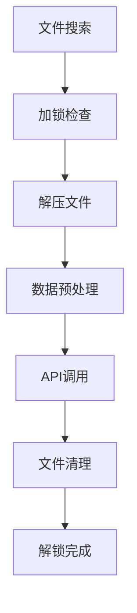
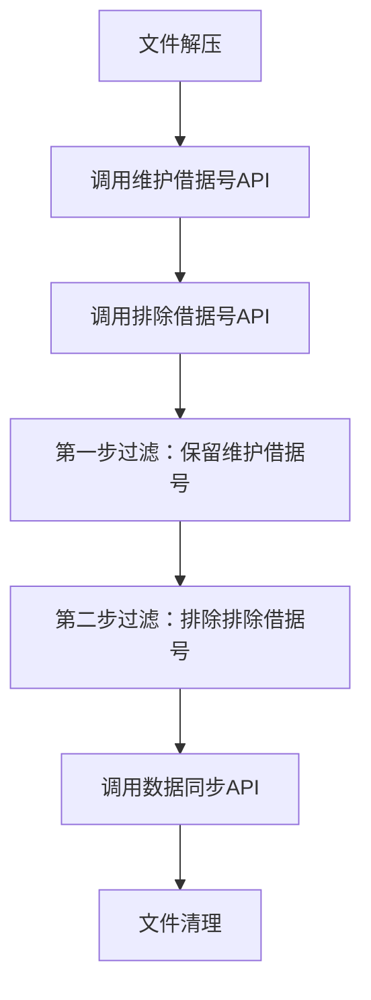

# 税务管理系统Shell+Java混合架构改造模块设计说明书

## 目录
1. [概述](#概述)
2. [架构说明](#架构说明)
3. [模块详细设计](#模块详细设计)
   - 3.1 [ift_ncbs_ccllna_acct (对公贷款账户主表)](#31-ift_ncbs_ccllna_acct-对公贷款账户主表)
   - 3.2 [ift_ncbs_ccllnb_basic_attr (对公贷款属性表)](#32-ift_ncbs_ccllnb_basic_attr-对公贷款属性表)
   - 3.3 [ift_ncbs_ccllnb_chk_write_off (对公贷款核销表)](#33-ift_ncbs_ccllnb_chk_write_off-对公贷款核销表)
   - 3.4 [ift_ncbs_ccllnb_non_perfmg_asset (对公贷款不良资产表)](#34-ift_ncbs_ccllnb_non_perfmg_asset-对公贷款不良资产表)
   - 3.5 [ift_ncbs_cgmdab_cl_loan_rlvc (抵债资产对公贷款关联表)](#35-ift_ncbs_cgmdab_cl_loan_rlvc-抵债资产对公贷款关联表)
4. [公共机制说明](#公共机制说明)
5. [部署和运维说明](#部署和运维说明)

---

## 概述

本文档详细说明了光大银行税务管理系统中五个关键模块的Shell+Java混合架构改造设计。这些模块从传统的纯Shell脚本处理方式改造为Shell脚本负责文件处理、Java后端负责业务逻辑的混合架构模式。

### 改造模块列表
1. **ift_ncbs_ccllna_acct** - 对公贷款账户主表（复杂度：★★★★★）
2. **ift_ncbs_ccllnb_basic_attr** - 对公贷款属性表（复杂度：★★★☆☆）
3. **ift_ncbs_ccllnb_chk_write_off** - 对公贷款核销表（复杂度：★★☆☆☆）
4. **ift_ncbs_ccllnb_non_perfmg_asset** - 对公贷款不良资产表（复杂度：★☆☆☆☆）
5. **ift_ncbs_cgmdab_cl_loan_rlvc** - 抵债资产对公贷款关联表（复杂度：★★★☆☆）

---

## 架构说明

### 传统架构 vs 混合架构

**传统架构**：Shell脚本直接操作数据库，所有业务逻辑都在Shell中实现

**混合架构**：
- **Shell脚本层**：负责文件发现、解压、数据预处理、文件管理
- **Java服务层**：负责复杂业务逻辑、数据验证、数据库操作
- **RESTful API**：Shell通过HTTP接口调用Java服务

### 核心优势
1. **分离关注点**：文件处理与业务逻辑分离
2. **可维护性**：业务逻辑集中在Java代码中，便于维护
3. **可扩展性**：Java服务可独立扩展和部署
4. **一致性**：统一的API接口标准

### 通用文件处理流程


---

## 模块详细设计

## 3.1 ift_ncbs_ccllna_acct (对公贷款账户主表)

### 脚本基本信息
- **文件名**：`ift_ncbs_ccllna_acct.sh`
- **功能**：对公贷款账户主表数据同步处理（架构重构版）
- **复杂度**：★★★★★（最高复杂度，包含双API调用和数据过滤）
- **代码行数**：269行
- **特殊功能**：双API调用机制 + 复杂数据过滤

### 核心业务流程


### 关键代码段解释

#### 1. 双API调用机制（第134-205行）
**维护借据号API调用**：
```bash
# 第一步：调用Java API获取需要维护的借据号
maintain_api_url="http://tms-app-cdc:19201/webapi/ncbs-ccllna-acct/getMaintainLnDueBillNos"
maintain_request_data=$(cat <<EOF
{
    "processDate": "${yesterday_with_dash}"
}
EOF
)
maintain_result=`curl -s $time_url -X POST -H "Content-Type: application/json" -d "$maintain_request_data" $maintain_api_url`
```
**作用**：获取需要维护的借据号列表，用于第一步数据过滤

**排除借据号API调用**：
```bash
# 第二步：调用Java API获取需要排除的借据号
exclusion_api_url="http://tms-app-cdc:19201/webapi/ncbs-ccllna-acct/getExclusionLnDueBillNos"
exclusion_result=`curl -s $time_url -X POST -H "Content-Type: application/json" -d "$exclusion_request_data" $exclusion_api_url`
```
**作用**：获取需要排除的借据号列表，用于第二步数据过滤

#### 2. 复杂数据过滤逻辑（第207-220行）
```bash
# 过滤逻辑1：只保留在维护表中的借据号
awk -F '\\|\\+\\|' 'NR==FNR {values[$1]; next} $1 in values' "$maintain_file" "$unzip_data_file" > "${work_dir}/temp1.txt"

# 过滤逻辑2：排除在排除表中的借据号
awk -F '\\|\\+\\|' 'NR==FNR {values[$1]; next} !($1 in values)' "$exclusion_file" "${work_dir}/temp1.txt" > "${work_dir}/temp2.txt"
```
**解释**：
- 分隔符：`|+|`（管道符分隔）
- 第一步：`NR==FNR`读取维护文件构建借据号索引，然后过滤数据文件
- 第二步：读取排除文件构建排除索引，然后排除匹配的记录
- `!($1 in values)`表示不在排除列表中的记录

#### 3. JSON响应解析（第164-168行）
```bash
maintain_file="${work_dir}/maintain_ln_due_bill_nos.txt"
echo "$maintain_result" | grep -o '"[^"]*"' | tr -d '"' > "$maintain_file"
```
**解释**：
- `grep -o '"[^"]*"'`：提取JSON中的字符串值
- `tr -d '"'`：删除双引号
- 将借据号列表保存到临时文件

### 脚本执行步骤详解

1. **初始化阶段**（第1-94行）
   - 设置环境变量和路径
   - 创建工作目录
   - 初始化日志系统
   - 加锁防止重复执行

2. **文件发现阶段**（第96-109行）
   - 搜索符合模式的.ok文件
   - 验证文件存在性

3. **文件处理阶段**（第111-132行）
   - 提取数据文件名
   - 解压到工作目录

4. **业务逻辑阶段**（第134-230行）
   - 调用维护借据号API
   - 调用排除借据号API
   - 执行两步数据过滤
   - 统计处理结果

5. **数据同步阶段**（第232-252行）
   - 调用数据同步API
   - 传递处理后的文件

6. **清理阶段**（第254-278行）
   - 删除临时文件
   - 备份原始文件
   - 解锁并返回结果

### 错误处理机制
- **API调用失败**：检查curl返回值，失败时解锁并退出
- **文件处理失败**：检查文件存在性，不存在时退出
- **重复执行保护**：通过文件锁机制防止并发执行
- **详细日志记录**：每个步骤都有时间戳和详细信息

### 配置参数说明
- **超时设置**：`--connect-timeout 30 --max-time 1800`
- **API端点**：
  - 维护借据号：`/webapi/ncbs-ccllna-acct/getMaintainLnDueBillNos`
  - 排除借据号：`/webapi/ncbs-ccllna-acct/getExclusionLnDueBillNos`
  - 数据同步：`/webapi/ncbs-ccllna-acct/sync`
- **文件格式**：`a_ncbs_ccllna_acct_YYYYMMDD_*.dat.gz.ok`

---

## 文档索引

本设计说明书包含以下文档：

1. **主文档**（当前文档）
   - 概述和架构说明
   - ift_ncbs_ccllna_acct 模块详细设计

2. **[第二部分](./税务管理系统Shell+Java混合架构改造模块设计说明书_第二部分.md)**
   - ift_ncbs_ccllnb_basic_attr 模块详细设计
   - ift_ncbs_ccllnb_chk_write_off 模块详细设计
   - ift_ncbs_ccllnb_non_perfmg_asset 模块详细设计
   - ift_ncbs_cgmdab_cl_loan_rlvc 模块详细设计
   - 公共机制说明
   - 部署和运维说明

3. **[五个模块对比分析与总结](./五个模块对比分析与总结.md)**
   - 模块复杂度对比
   - 核心功能差异分析
   - 设计模式总结
   - API接口标准化
   - 性能优化策略
   - 运维监控建议
   - 未来扩展建议

## 快速导航

### 按复杂度查看模块
- **最复杂** ⭐⭐⭐⭐⭐：[ift_ncbs_ccllna_acct](#31-ift_ncbs_ccllna_acct-对公贷款账户主表)（双API调用+复杂过滤）
- **标准复杂度** ⭐⭐⭐☆☆：[ift_ncbs_ccllnb_basic_attr](./税务管理系统Shell+Java混合架构改造模块设计说明书_第二部分.md#32-ift_ncbs_ccllnb_basic_attr-对公贷款属性表)（标准模式）
- **中等复杂度** ⭐⭐⭐☆☆：[ift_ncbs_cgmdab_cl_loan_rlvc](./税务管理系统Shell+Java混合架构改造模块设计说明书_第二部分.md#35-ift_ncbs_cgmdab_cl_loan_rlvc-抵债资产对公贷款关联表)（日期过滤）
- **简化复杂度** ⭐⭐☆☆☆：[ift_ncbs_ccllnb_chk_write_off](./税务管理系统Shell+Java混合架构改造模块设计说明书_第二部分.md#33-ift_ncbs_ccllnb_chk_write_off-对公贷款核销表)（简化日志）
- **最简复杂度** ⭐☆☆☆☆：[ift_ncbs_ccllnb_non_perfmg_asset](./税务管理系统Shell+Java混合架构改造模块设计说明书_第二部分.md#34-ift_ncbs_ccllnb_non_perfmg_asset-对公贷款不良资产表)（极简模式）

### 按功能特点查看模块
- **复杂业务逻辑**：ccllna_acct（双API调用+数据过滤）
- **标准处理流程**：ccllnb_basic_attr（完整日志+错误处理）
- **数据过滤处理**：cgmdab_cl_loan_rlvc（按维护日期过滤）
- **性能优化处理**：ccllnb_chk_write_off（简化日志）
- **极简快速处理**：ccllnb_non_perfmg_asset（最小化功能）

---

## 总结

本设计说明书详细阐述了五个税务管理系统模块从传统Shell架构向Shell+Java混合架构的改造过程。每个模块都采用了适合其业务特点的设计策略，从最复杂的双API调用过滤模式到最简化的极简处理模式，体现了架构设计的灵活性和适应性。

通过统一的API接口标准、一致的错误处理机制和分级的日志记录策略，确保了系统的可维护性和可扩展性，为税务管理系统的长期发展奠定了坚实的技术基础。
