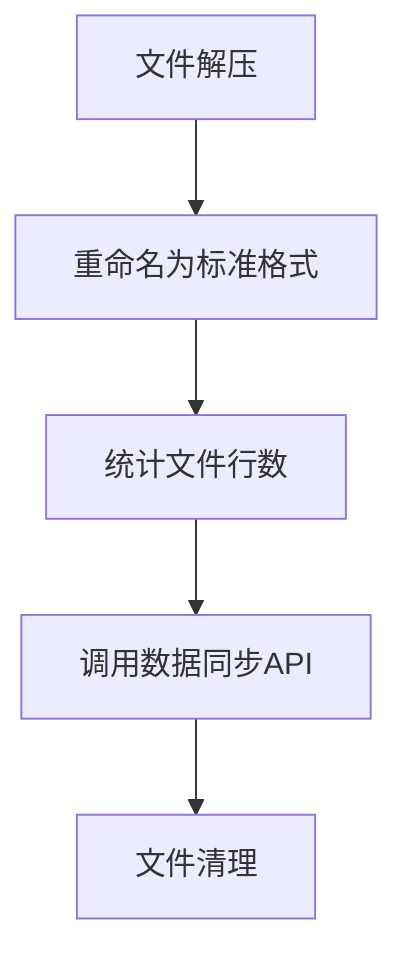
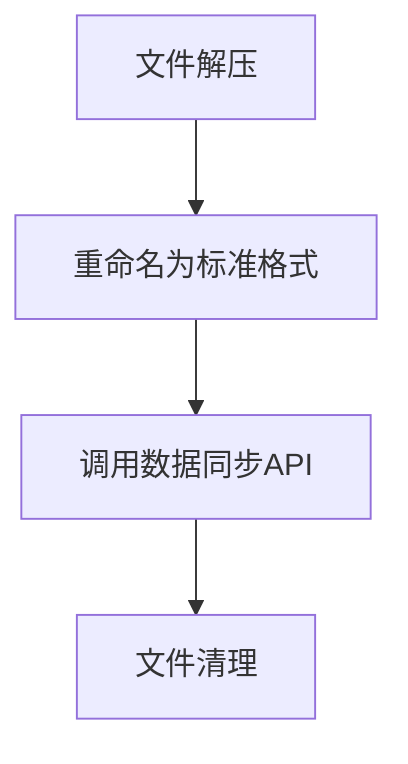
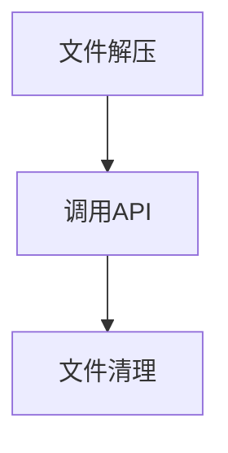
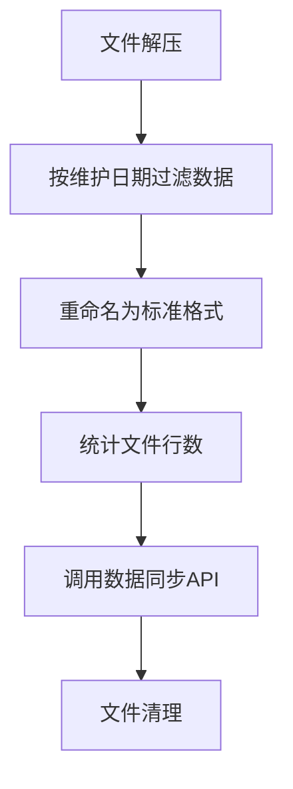

# 税务管理系统Shell+Java混合架构改造模块设计说明书 - 第二部分

## 3.2 ift_ncbs_ccllnb_basic_attr (对公贷款属性表)

### 脚本基本信息
- **文件名**：`ift_ncbs_ccllnb_basic_attr.sh`
- **功能**：对公贷款属性表数据同步处理（架构重构版）
- **复杂度**：★★★☆☆（标准复杂度，标准的文件处理流程）
- **代码行数**：196行
- **特殊功能**：标准模式，完整的日志记录和错误处理

### 核心业务流程


### 关键代码段解释

#### 1. 标准文件处理流程（第111-132行）
```bash
for file in $files; do
    echo `date "+%Y-%m-%d %H:%M:%S"` "ok文件=${file}" >> ${LOGFILE}
    data_file="${file%.ok}"
    
    unzip_data_file="${work_dir}/$(basename ${data_file%.gz})"
    gunzip -c "${data_file}" > "${unzip_data_file}"
    
    # 修改名称为标准格式
    mv "${unzip_data_file}" "${work_dir}/${TARGET_FILE}"
```
**解释**：
- 标准的文件解压流程
- 直接重命名为目标文件格式
- 无需复杂的数据过滤

#### 2. 文件行数统计（第139-141行）
```bash
line_count=$(wc -l < "${work_dir}/${TARGET_FILE}")
echo `date "+%Y-%m-%d %H:%M:%S"` "处理后文件行数: $line_count" >> ${LOGFILE}
```
**解释**：使用`wc -l`统计文件行数，用于日志记录和监控

#### 3. 数据同步API调用（第143-165行）
```bash
api_url="http://tms-app-cdc:19201/webapi/ncbs-ccllnb-basic-attr/sync"
time_url="--connect-timeout 30 --max-time 1800"

request_data=$(cat <<EOF
{
    "filePath": "${work_dir}/${TARGET_FILE}",
    "processDate": "${yesterday_with_dash}",
    "tableName": "tp_ncbs_${org_table_name}"
}
EOF
)

result=`curl -s $time_url -X POST -H "Content-Type: application/json" -d "$request_data" $api_url`
```
**解释**：
- 单一API调用，传递文件路径、处理日期、表名
- 超时设置与其他模块一致
- JSON格式请求参数

### 脚本特点
1. **简化流程**：相比ccllna_acct模块，无需复杂的数据过滤
2. **完整日志**：保留详细的日志记录机制
3. **标准错误处理**：包含所有必要的错误检查
4. **统一接口**：使用标准的API调用格式

---

## 3.3 ift_ncbs_ccllnb_chk_write_off (对公贷款核销表)

### 脚本基本信息
- **文件名**：`ift_ncbs_ccllnb_chk_write_off.sh`
- **功能**：对公贷款核销表数据同步处理（架构重构版）
- **复杂度**：★★☆☆☆（简化复杂度，保留核心功能）
- **代码行数**：170行
- **特殊功能**：简化版本，减少了部分详细日志

### 核心业务流程


### 关键代码段解释

#### 1. 简化的日志记录（与basic_attr对比）
**basic_attr模块**：
```bash
echo `date "+%Y-%m-%d %H:%M:%S"` "处理后文件行数: $line_count" >> ${LOGFILE}
echo `date "+%Y-%m-%d %H:%M:%S"` "请求参数: $request_data" >> ${LOGFILE}
echo `date "+%Y-%m-%d %H:%M:%S"` "调用接口: $api_url" >> ${LOGFILE}
```

**chk_write_off模块**：
```bash
# 省略了部分详细日志记录
```
**解释**：去除了部分详细的中间日志，保留核心处理日志

#### 2. 相同的API调用结构（第120-140行）
```bash
api_url="http://tms-app-cdc:19201/webapi/ncbs-ccllnb-chk-write-off/sync"
time_url="--connect-timeout 30 --max-time 1800"

request_data=$(cat <<EOF
{
    "filePath": "${work_dir}/${TARGET_FILE}",
    "processDate": "${yesterday_with_dash}",
    "tableName": "tp_ncbs_${org_table_name}"
}
EOF
)
```
**解释**：API调用格式与其他模块完全一致，只是URL不同

### 脚本特点
1. **精简日志**：减少了非关键的日志输出
2. **保持一致性**：核心处理逻辑与其他模块一致
3. **标准接口**：API调用格式统一

---

## 3.4 ift_ncbs_ccllnb_non_perfmg_asset (对公贷款不良资产表)

### 脚本基本信息
- **文件名**：`ift_ncbs_ccllnb_non_perfmg_asset.sh`
- **功能**：对公贷款不良资产表数据同步处理（架构重构版）
- **复杂度**：★☆☆☆☆（最简复杂度，极简的处理流程）
- **代码行数**：124行
- **特殊功能**：最小化版本，去除了大部分日志记录

### 核心业务流程


### 关键代码段解释

#### 1. 极简的日志初始化（第46-50行）
```bash
if [ ! -d ${LOGPATH} ]; then
	mkdir -p ${LOGPATH}
fi
touch ${LOGFILE}
```
**解释**：
- 去除了详细的日志记录消息
- 只保留必要的目录创建和文件初始化

#### 2. 简化的锁函数（第54-61行）
```bash
tmsLock(){
	if [ -f ${CHECK_LOCK_FILE} ] ;then
        echo "100"
        exit 100
	else
		touch ${CHECK_LOCK_FILE}
	fi
}
```
**解释**：
- 去除了日志记录
- 只保留核心的锁检查逻辑

#### 3. 最简的错误处理（第69-74行）
```bash
if [ -z "$files" ]; then
    fail='-1'
    echo $fail
    tmsUnlock
    exit 1
fi
```
**解释**：
- 去除了详细的错误日志
- 只保留必要的错误状态返回

#### 4. 核心API调用（第86-96行）
```bash
api_url="http://tms-app-cdc:19201/webapi/ncbs-ccllnb-non-perfmg-asset/sync"
time_url="--connect-timeout 30 --max-time 1800"

request_data=$(cat <<EOF
{
    "filePath": "${work_dir}/${TARGET_FILE}",
    "processDate": "${yesterday_with_dash}",
    "tableName": "tp_ncbs_${org_table_name}"
}
EOF
)

result=`curl -s $time_url -X POST -H "Content-Type: application/json" -d "$request_data" $api_url`
```
**解释**：API调用格式保持一致，确保接口标准化

### 脚本特点
1. **极简设计**：去除所有非必要的日志和检查
2. **保持功能完整性**：核心功能不受影响
3. **统一接口**：API调用标准保持一致
4. **快速执行**：减少I/O操作，提高执行速度

---

## 3.5 ift_ncbs_cgmdab_cl_loan_rlvc (抵债资产对公贷款关联表)

### 脚本基本信息
- **文件名**：`ift_ncbs_cgmdab_cl_loan_rlvc.sh`
- **功能**：抵债资产对公贷款关联表数据同步处理（架构重构版）
- **复杂度**：★★★☆☆（中等复杂度，包含按维护日期过滤数据的逻辑）
- **代码行数**：205行
- **特殊功能**：按维护日期过滤数据

### 核心业务流程


### 关键代码段解释

#### 1. 维护日期列定义（第20行）
```bash
maintain_date_col=47
```
**解释**：定义维护日期所在的列号（第47列）

#### 2. 数据过滤逻辑（第120-126行）
```bash
if [ -n "$maintain_date_col" ]; then
    # 过滤数据
    echo `date "+%Y-%m-%d %H:%M:%S"` "过滤数据 yesterday_with_dash=$yesterday_with_dash" >> ${LOGFILE}
    awk -F '\\|\\+\\|' -v maintain_date_col="$maintain_date_col" -v today_with_dash="$today_with_dash" -v yesterday_with_dash="$yesterday_with_dash" '$maintain_date_col == yesterday_with_dash' "$unzip_data_file" > "${work_dir}/temp.txt"
    mv "${work_dir}/temp.txt" "$unzip_data_file"
fi
```
**解释**：
- 检查维护日期列是否定义
- 使用awk按维护日期过滤数据
- 只保留维护日期等于昨天的记录
- 分隔符为`|+|`
- 使用临时文件进行处理

#### 3. awk过滤命令详解
```bash
awk -F '\\|\\+\\|' -v maintain_date_col="$maintain_date_col" -v yesterday_with_dash="$yesterday_with_dash" '$maintain_date_col == yesterday_with_dash'
```
**参数说明**：
- `-F '\\|\\+\\|'`：设置字段分隔符为`|+|`
- `-v maintain_date_col="$maintain_date_col"`：传递列号变量
- `-v yesterday_with_dash="$yesterday_with_dash"`：传递昨天日期变量
- `$maintain_date_col == yesterday_with_dash`：过滤条件，第47列等于昨天日期

#### 4. 文件行数统计（第138-140行）
```bash
line_count=$(wc -l < "${work_dir}/${TARGET_FILE}")
echo `date "+%Y-%m-%d %H:%M:%S"` "处理后文件行数: $line_count" >> ${LOGFILE}
```
**解释**：统计过滤后的文件行数，用于监控数据处理效果

#### 5. API调用（第146-166行）
```bash
api_url="http://tms-app-cdc:19201/webapi/ncbs-cgmdab-cl-loan-rlvc/sync"

request_data=$(cat <<EOF
{
    "filePath": "${work_dir}/${TARGET_FILE}",
    "processDate": "${yesterday_with_dash}",
    "tableName": "tp_ncbs_${org_table_name}"
}
EOF
)

result=`curl -s $time_url -X POST -H "Content-Type: application/json" -d "$request_data" $api_url`
```
**解释**：标准的API调用格式，传递处理后的文件

### 脚本特点
1. **数据过滤**：按维护日期进行智能过滤
2. **灵活配置**：维护日期列可配置
3. **完整日志**：详细记录过滤过程和结果
4. **标准接口**：保持API调用一致性

---

## 4. 公共机制说明

### 4.1 文件锁机制
所有脚本都使用文件锁防止重复执行：
```bash
CHECK_LOCK_FILE="${LOGPATH}/tms_sync_ift_data_${org_table_name}.lock"
```
- **锁文件位置**：日志目录下
- **锁文件命名**：包含表名的唯一标识
- **锁定检查**：脚本启动时检查锁文件是否存在
- **自动解锁**：脚本结束时自动删除锁文件

### 4.2 日志记录机制
```bash
LOGPATH="/cebtms/files/logs/batch/${DN_OUTPUT}"
LOGFILE="${LOGPATH}/tms_sync_ift_data_${org_table_name}_${DN_OUTPUT}.log"
```
- **日志目录**：按日期分目录存储
- **日志文件**：包含表名和日期的唯一标识
- **时间戳**：所有日志都包含精确的时间戳
- **详细程度**：不同模块的日志详细程度不同

### 4.3 文件处理模式
```bash
pattern="a_ncbs_${org_table_name}_${yesterday}_*.dat.gz.ok"
```
- **文件命名规范**：`a_ncbs_表名_日期_序号.dat.gz.ok`
- **压缩格式**：gzip压缩
- **完成标识**：.ok文件表示传输完成
- **日期格式**：YYYYMMDD格式

### 4.4 API调用标准
所有模块的API调用都遵循统一标准：
```bash
api_url="http://tms-app-cdc:19201/webapi/模块路径/sync"
time_url="--connect-timeout 30 --max-time 1800"
request_data='{
    "filePath": "文件路径",
    "processDate": "处理日期",
    "tableName": "表名"
}'
```

### 4.5 错误处理规范
- **返回码**：成功0，失败-1，重复执行100
- **解锁保证**：任何错误退出都确保解锁
- **日志记录**：错误信息详细记录到日志文件
- **状态输出**：返回码同时输出到标准输出和日志文件

---

## 5. 部署和运维说明

### 5.1 目录结构要求
```
/cebtms/files/
├── ift/
│   ├── ecas/          # 源文件目录
│   └── work/          # 工作目录
│       ├── ccllna_acct/
│       ├── ccllnb_basic_attr/
│       ├── ccllnb_chk_write_off/
│       ├── ccllnb_non_perfmg_asset/
│       └── cgmdab_cl_loan_rlvc/
├── bak/
│   └── ift/
│       └── ecas/      # 备份目录
└── logs/
    └── batch/
        └── YYYYMMDD/  # 按日期分目录的日志
```

### 5.2 Java服务依赖
确保以下Java API服务可用：
- `http://tms-app-cdc:19201/webapi/ncbs-ccllna-acct/*`
- `http://tms-app-cdc:19201/webapi/ncbs-ccllnb-basic-attr/sync`
- `http://tms-app-cdc:19201/webapi/ncbs-ccllnb-chk-write-off/sync`
- `http://tms-app-cdc:19201/webapi/ncbs-ccllnb-non-perfmg-asset/sync`
- `http://tms-app-cdc:19201/webapi/ncbs-cgmdab-cl-loan-rlvc/sync`

### 5.3 调度配置建议
- **执行时间**：建议在每日凌晨执行
- **执行顺序**：各模块可并行执行
- **监控检查**：检查返回码和日志文件
- **异常处理**：返回100表示重复执行，-1表示处理失败

### 5.4 监控要点
1. **文件处理量**：监控每日处理的文件数量和记录数
2. **执行时间**：监控脚本执行时长
3. **错误率**：监控API调用失败率
4. **存储空间**：监控工作目录和备份目录空间使用